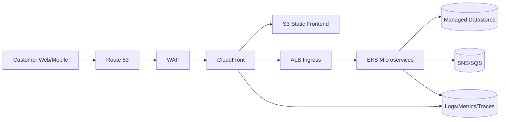

# End-to-end eCommerce platform document (AWS)

This document describes an end-to-end cloud-native eCommerce platform using:

- **S3 + CloudFront** for a serverless frontend
- **AWS WAF** for edge protection
- **Amazon EKS** for scalable microservices
- **Managed data stores**, **messaging**, and **analytics**
- **High Availability (Multi-AZ)** and **Disaster Recovery (Multi-Region warm standby)**

---

## 1) Architecture overview

### 1.1 Request flow (user → edge → app → data)



### 1.2 Network layout (VPC public/private)

- **Public subnets**: ALB (ingress), NAT Gateway(s)
- **Private subnets**: EKS nodes/pods, internal service traffic, data plane connectivity
- **IGW**: internet connectivity for public resources; **private** workloads use NAT for controlled outbound

```mermaid
flowchart TB
  CF[CloudFront + WAF] --> ALB[ALB (Public Subnets)]

  subgraph VPC[VPC (Multi-AZ)]
    subgraph PUB[Public Subnets]
      ALB
      NAT[NAT Gateways]
      IGW[Internet Gateway]
    end

    subgraph PRIV[Private Subnets]
      EKS[EKS Workloads]
      DATA[(Aurora/DynamoDB/Redis/OpenSearch)]
    end

    IGW --- PUB
    PRIV -->|Outbound| NAT
    NAT --> IGW
    ALB --> EKS
    EKS --> DATA
  end
```

---

## 2) Components and why we chose them

### 2.1 Frontend + edge
- **S3 (static web hosting)**: durable, low cost, serverless hosting for SPA assets.
- **CloudFront**: global caching and TLS termination; improves latency and protects origins.
- **AWS WAF**: managed rules (OWASP), bot/rate limiting, IP reputation, and centralized L7 protection.
- **Route 53**: HA DNS plus health checks and failover routing (used in DR).

### 2.2 Backend compute
- **Amazon EKS**: Kubernetes ecosystem + strong scaling model for microservices; supports rolling updates, HPA, blue/green/canary, and multi-AZ node groups.
- **ALB (AWS Load Balancer Controller)**: L7 ingress to EKS; health checks and weighted routing support.

### 2.3 Data stores (managed)
- **Aurora (Postgres/MySQL)**: relational source of truth (orders/users/payments); Multi-AZ HA.
- **DynamoDB**: low-latency key-value for carts/sessions; autoscaling; Global Tables for multi-region DR.
- **ElastiCache (Redis)**: hot cache and rate-limit state to offload DBs.
- **OpenSearch**: product search, facets, indexing, and relevance ranking.

### 2.4 Messaging
- **SNS + SQS (+ DLQ)**: decouple services, absorb spikes, safe retries, and isolate failures.

### 2.5 Analytics
- **Kinesis/Firehose → S3 data lake → Glue/Athena → QuickSight**: cost-efficient clickstream + order analytics with serverless query + BI.

### 2.6 Security
- **Cognito**: managed auth (OIDC/OAuth2), MFA options, token-based API auth.
- **KMS + Secrets Manager**: encryption and secret rotation for DB/API credentials.
- **IRSA (IAM Roles for Service Accounts)**: least-privilege access from pods to AWS APIs.

---

## 3) Microservices design

### 3.1 Suggested microservices
- **API/BFF**: frontend-facing API aggregation, auth enforcement, response shaping.
- **Catalog**: products + pricing.
- **Cart**: carts/sessions (often DynamoDB).
- **Order**: order state machine + persistence (often Aurora).
- **Payments**: idempotent payment orchestration; reconciles webhooks.
- **Notifications**: email/SMS/push from events.
- **Search**: OpenSearch query + indexing workers.

### 3.2 Key patterns
- **Synchronous** for interactive reads; **async events** for workflows and side-effects.
- **Idempotency keys** on checkout/payment/order create to prevent duplicates.
- **Timeouts + retries + circuit breakers** to avoid cascading failures.
- **Backpressure** via queues for burst traffic.

---

## 4) High Availability (HA)

### 4.1 HA goals
- Survive single-instance and single-AZ failures inside a region.
- Maintain performance under spikes (autoscaling).

### 4.2 HA design
- **CloudFront** caches static + API responses where appropriate.
- **ALB** spans multiple AZs and removes unhealthy targets.
- **EKS** runs replicas across AZs with:
  - Horizontal Pod Autoscaler (HPA)
  - PodDisruptionBudgets (PDB)
  - Multi-AZ node groups
- **Datastores**:
  - Aurora Multi-AZ failover
  - DynamoDB multi-AZ by design
  - OpenSearch multi-AZ (replicas + snapshots)
  - Redis replication groups (Multi-AZ)

```mermaid
flowchart TB
  CF[CloudFront + WAF] --> ALB[ALB (Multi-AZ)]
  subgraph VPC[VPC]
    subgraph AZA[AZ-A]
      E1[EKS pods A]
    end
    subgraph AZB[AZ-B]
      E2[EKS pods B]
    end
  end
  ALB --> E1
  ALB --> E2
  E1 --> AUR[(Aurora Multi-AZ)]
  E2 --> AUR
  E1 --> DDB[(DynamoDB)]
  E2 --> DDB
```

---

## 5) Disaster Recovery (DR) strategy (Multi-Region warm standby)

### 5.1 DR posture
- **Warm standby**: Region B runs scaled-down EKS and replicated data, ready for promotion.
- **Traffic failover**: Route 53 health checks + CloudFront origin failover.

### 5.2 Multi-region replication
- **S3**: Cross-Region Replication (CRR) for critical buckets (frontend assets, media, data lake).
- **Aurora**: Aurora Global Database (replicate to Region B, promote on failover).
- **DynamoDB**: Global Tables (active-active replication).
- **OpenSearch / Redis**: snapshots/restore (or CCR where applicable).

```mermaid
flowchart LR
  U[Users] --> R53[Route53 Failover]
  R53 --> CF[CloudFront]
  CF --> A_ALB[Region A ALB]
  CF --> B_ALB[Region B ALB (Failover)]
  A_ALB --> A_EKS[EKS A]
  B_ALB --> B_EKS[EKS B (Warm Standby)]
  A_EKS --> A_AUR[(Aurora A Writer)]
  B_EKS --> B_AUR[(Aurora B Reader -> Promote)]
  A_AUR == Aurora Global DB ==> B_AUR
  A_EKS --> A_DDB[(DynamoDB Global Tables)]
  B_EKS --> B_DDB[(DynamoDB Global Tables)]
  A_DDB == Replication ==> B_DDB
```

### 5.3 DR runbook (summary)
- Detect outage (health checks + alarms).
- Fail over DNS/origins to Region B.
- Promote Aurora in Region B to writer.
- Scale up Region B EKS workloads.
- Validate critical flows (login, browse, cart, checkout).
- Plan controlled failback after Region A recovery.

---

## 6) Monitoring

### 6.1 What to monitor (minimum set)
- **CloudFront**: 4xx/5xx, origin latency, cache hit ratio.
- **WAF**: blocked requests, top rules, bot metrics.
- **ALB**: target errors, p95 latency, unhealthy hosts.
- **EKS**: pod restarts, CPU/mem saturation, HPA events, node pressure.
- **Queues**: SQS depth, age of oldest, DLQ count.
- **DB**: Aurora connections/slow queries/replication lag; DynamoDB throttles; Redis evictions; OpenSearch health.

### 6.2 Tooling
- CloudWatch logs/metrics + alarms
- Distributed tracing via X-Ray or OpenTelemetry
- Dashboards per SLO (checkout success rate, API p95, error budget burn)

---

## 7) Troubleshooting (fast path)

### “Site is slow”
- Check CloudFront origin latency and cache hit ratio.
- Check ALB target latency/unhealthy hosts.
- Check EKS saturation (CPU/mem), HPA scaling, restart loops.
- Check DB/Redis/OpenSearch bottlenecks (connections, evictions, health).

### “Checkout fails”
- Validate idempotency for payment/order create.
- Inspect SQS DLQs and consumer error rates.
- Confirm dependent upstream health (catalog, payment provider, DB).

---

## 8) Connectivity

### External
- Users → Route53 → WAF → CloudFront
- CloudFront → S3 (static/media)
- CloudFront → ALB (API)

### Internal (VPC)
- ALB → EKS (private)
- Service-to-service via Kubernetes DNS
- Prefer **VPC endpoints** (S3, ECR, CloudWatch, STS) to reduce NAT cost and exposure

---

## 9) CI/CD pipeline design + automation

### 9.1 Pipeline goals
- Repeatable deployments across dev/stage/prod
- Immutable artifacts (versioned images + frontend builds)
- Automated tests + security gates
- GitOps for cluster drift prevention

### 9.2 CI/CD diagram (recommended)

```mermaid
flowchart LR
  PR[Pull Request] --> CI[CI: lint + unit tests + SAST]
  CI --> IMG[Build images]
  IMG --> ECR[(ECR)]
  CI --> TFPLAN[Terraform plan]
  TFPLAN --> TFAPPLY[Terraform apply (approved)]
  TFAPPLY --> AWS[(AWS: VPC/EKS/ALB/WAF/CF/S3/DB/Queues)]
  ECR --> GITOPS[Update manifests/Helm values]
  GITOPS --> ARGO[Argo CD/Flux]
  ARGO --> EKS[(EKS deploy)]
  EKS --> SMOKE[Smoke tests]
  SMOKE --> OBS[Alarms/Dashboards]

  FE[Frontend build] --> S3UP[Upload to S3]
  S3UP --> CFINV[CloudFront invalidation]
```

### 9.3 How we automate per component (DevOps lifecycle)
- **CloudFront/S3/WAF/Route53**: Terraform manages distributions/buckets/WebACL/DNS; frontend pipeline uploads assets + invalidates cache.
- **EKS/ALB Ingress**: Terraform provisions cluster + OIDC; GitOps applies K8s manifests; progressive delivery via canary/blue-green (optional).
- **Datastores**: Terraform provisions; migrations run as controlled jobs; backups/retention enforced by policy.
- **SQS/SNS/Kinesis**: Terraform provisions; consumers deployed via GitOps; DLQ alarms trigger runbooks.
- **Observability**: Terraform for CloudWatch alarms/dashboards; OTel collectors deployed via GitOps.

---

## 10) AWS service setup steps (practical checklist)

> This is the “human readable” setup; in production you should codify these in Terraform.

### 10.1 Networking
- Create VPC across 2–3 AZs.
- Create **public subnets** (ALB + NAT) and **private subnets** (EKS + data plane).
- Add **IGW** + route tables for public subnets.
- Add **NAT Gateways** (per AZ if HA needed) + private route tables.
- Add **VPC endpoints**:
  - S3 gateway endpoint
  - Interface endpoints for ECR (api+dkr), CloudWatch Logs, STS, Secrets Manager (as needed)

### 10.2 EKS
- Create EKS cluster with OIDC provider enabled.
- Create managed node groups (multi-AZ) or Fargate profiles.
- Install:
  - AWS Load Balancer Controller
  - ExternalDNS (optional)
  - cert-manager (optional)
  - metrics-server (for HPA)
- Configure IRSA roles for services (least privilege).

### 10.3 Frontend delivery
- Create S3 bucket for static frontend, enable versioning.
- Create CloudFront distribution:
  - Origin: S3 (static)
  - Origin: ALB (API)
  - Path-based routing (e.g., `/api/*` → ALB)
- Attach WAF WebACL to CloudFront.
- Configure Route53 DNS → CloudFront.

### 10.4 Data + messaging
- Aurora cluster (Multi-AZ) + security groups.
- DynamoDB tables (cart/session) + TTL.
- ElastiCache (Redis) replication group (Multi-AZ).
- OpenSearch multi-AZ domain + snapshots.
- SNS topics + SQS queues + DLQs.
- Kinesis/Firehose delivery to S3 data lake (optional).

### 10.5 DR
- Configure Route53 health checks and failover records.
- Enable S3 CRR to DR region.
- Configure Aurora Global Database.
- Configure DynamoDB Global Tables.
- Define runbooks and perform failover drills.

